# tModLoader 新手开发：线性学习指南

> 面向已经完成开发环境配置、准备第一次认真制作模组的开发者。
>
> 整理日期：2026-07-02。主要依据 [tModLoader 开发者入口 Wiki](https://github.com/tModLoader/tModLoader/wiki/tModLoader-guide-for-developers)、其直接关联教程、[稳定版 API 文档](https://docs.tmodloader.net/docs/stable/) 与 [ExampleMod（stable 分支）](https://github.com/tModLoader/tModLoader/tree/stable/ExampleMod)。

这不是把 119 个 Wiki 页面逐页直译后堆在一起，而是把其中仍适用于当前 1.4.4 系列的知识重新排成一条学习路线。原 Wiki 的关键图片保留在对应章节；较深、较旧或偏离开发主线的页面放到最后作为索引。

## 你会走过的路线

1. 确认项目能构建和重载。
2. 理解内容类、实体、Hook、Type 与 Index。
3. 做出材料、武器、配方和本地化。
4. 让武器发射自定义弹幕。
5. 添加敌怪生成与掉落，形成一个可玩的内容闭环。
6. 用 `ModPlayer`、`ModSystem` 和 `TagCompound` 保存状态。
7. 添加方块、家具和简单世界生成。
8. 学会资源、声音、配置、UI 与联机边界。
9. 用日志、断点、ExampleMod 和原版代码独立解决问题。
10. 最后再进入 Boss、复杂 UI、Shader、Detour、IL 编辑和跨模组兼容。

如果你只想尽快做出第一个可玩的版本，先读到第 6 章。第 7～11 章是从“能跑”走向“可靠”的部分。

## 目录

- [第 0 章：环境检查](#chapter-0)
- [第 1 章：核心心智模型](#chapter-1)
- [第 2 章：材料、武器、配方与本地化](#chapter-2)
- [第 3 章：弹幕与 AI](#chapter-3)
- [第 4 章：NPC、生成与掉落](#chapter-4)
- [第 5 章：ModPlayer 与玩家效果](#chapter-5)
- [第 6 章：TagCompound 保存与加载](#chapter-6)
- [第 7 章：Tile、Wall 与 Tile Entity](#chapter-7)
- [第 8 章：世界生成](#chapter-8)
- [第 9 章：资源、声音、配置与 UI](#chapter-9)
- [第 10 章：多人联机](#chapter-10)
- [第 11 章：调试](#chapter-11)
- [第 12 章：从 ExampleMod、API 与原版代码学习](#chapter-12)
  - [专题：ExampleMod 1.4.5 源码导读](docs/examplemod-1.4.5-source-guide.md)
  - [索引：ExampleMod 逐目录、逐类与主要方法](docs/examplemod-1.4.5-class-index.md)
- [第 13 章：发布与维护](#chapter-13)
- [第 14 章：常用专题支线](#chapter-14)
- [第 15 章：高级主题](#chapter-15)
- [附录 A：六周练习计划](#appendix-a)
- [附录 B：需求到 API 速查表](#appendix-b)
- [附录 C：Wiki 页面取舍](#appendix-c)
- [附录 D：每个功能的完成定义](#appendix-d)
- [附录 E：图片与来源说明](#appendix-e)

---

<a id="chapter-0"></a>

## 第 0 章：环境只做一次检查

你已经搭好环境，因此这里只保留故障排查所需的最小检查表。

- tModLoader 当前开发环境使用 **.NET 8 SDK**，不是 .NET 9/10。`dotnet --list-sdks` 应至少出现一个 `8.x`。
- IDE 能打开模组生成的 `.csproj`，并识别 `Terraria`、`Terraria.ModLoader` 等命名空间。
- 在游戏内依次进入“创意工坊 → 开发模组”，能看到自己的模组。
- “构建并重新加载（Build + Reload）”可以成功完成。
- 不要删除 `.csproj` 和 `Properties/launchSettings.json`；以后启动调试器要用它们。

原 Wiki 的创建模组界面如下。内部名以后会进入程序集、命名空间、本地化键和创意工坊标识，准备发布时应使用唯一、无空格的 PascalCase 名称。

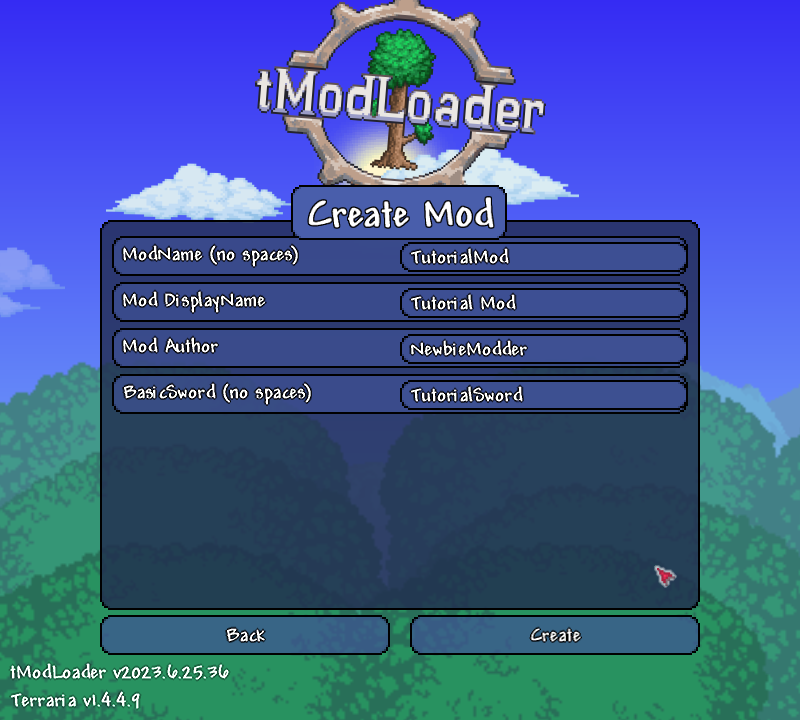

生成后的项目骨架大致如下：

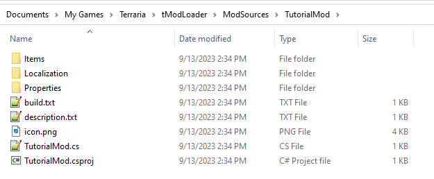

点击构建并重载：

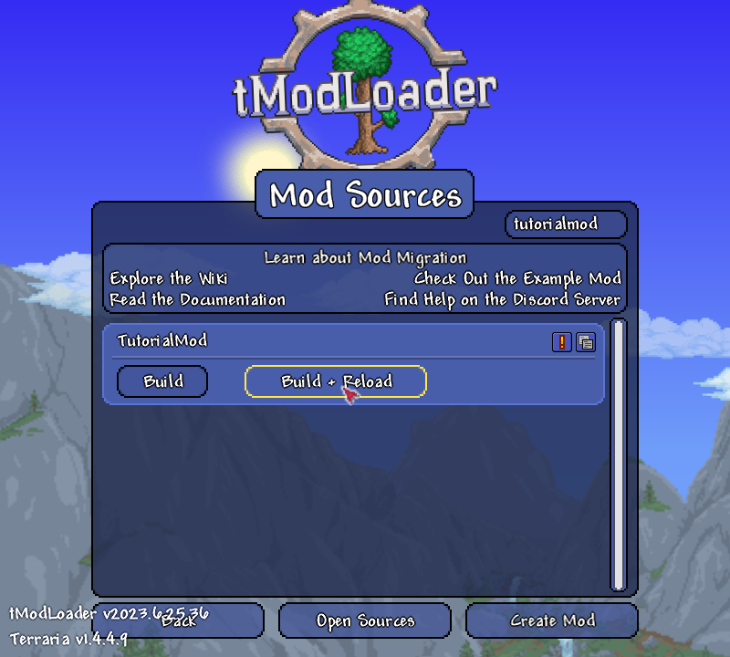

第一次成功标准很朴素：进入世界、取得生成器自带的武器、改变它的伤害后重新构建，游戏里的数值也随之变化。

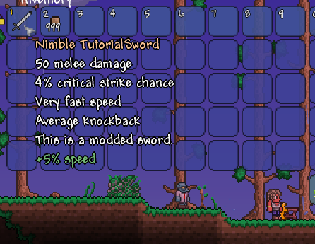

### 项目里最先要认识的文件

| 文件或目录 | 用途 | 新手现在是否要改 |
| --- | --- | --- |
| `你的模组.cs` | 唯一的 `Mod` 主类；模组级加载、卸载和网络包入口 | 通常先不改 |
| `build.txt` | 内部版本、作者、显示名、依赖关系 | 要认识 |
| `description.txt` | 游戏内模组说明 | 发布前改 |
| `description_workshop.txt` | Steam 创意工坊说明，可使用 BBCode | 发布前改 |
| `Content/` | 物品、弹幕、NPC、方块等内容 | 主要工作区 |
| `Common/` | 玩家扩展、全局修改、系统、配置、UI 等共享逻辑 | 很快会用到 |
| `Localization/` | `.hjson` 本地化文本 | 从第一天就使用 |
| `icon.png` | 游戏内 80×80 图标 | 发布前改 |
| `icon_workshop.png` | 可选的工坊大图标，最大 512×512 | 发布前改 |

建议目录从一开始就按职责划分，不要让几十个 `.cs` 文件平铺在根目录：

```text
LearningMod/
├── LearningMod.cs
├── build.txt
├── Content/
│   ├── Items/
│   │   ├── Materials/
│   │   └── Weapons/
│   ├── Projectiles/
│   ├── NPCs/
│   └── Tiles/
├── Common/
│   ├── GlobalNPCs/
│   ├── Players/
│   ├── Systems/
│   ├── Configs/
│   └── UI/
└── Localization/
    ├── en-US_Mods.LearningMod.hjson
    └── zh-Hans_Mods.LearningMod.hjson
```

---

<a id="chapter-1"></a>

## 第 1 章：先建立正确的心智模型

这一章比背 API 更重要。很多新手错误不是语法错误，而是把“物品”“弹幕”“方块”“类型编号”“世界里的某个实例”混成了同一件事。

### 1.1 内容定义与运行时实体

`ModItem`、`ModProjectile`、`ModNPC`、`ModTile` 是你写的**内容定义类**。游戏加载模组时会注册这些定义，并分配内容 `Type`。

`Item`、`Projectile`、`NPC`、`Player` 则是游戏运行时使用的数据对象。比如：

- `ShardBlade : ModItem` 定义“星屑刃这种物品应该是什么样”。
- 玩家背包里的某一把星屑刃，是一个具体的 `Item` 实例。
- `ShardBolt : ModProjectile` 定义一种弹幕。
- 世界里同时飞行的三枚星屑弹，是三个不同的 `Projectile` 实例。

因此，在 `ModItem` 中通常通过 `Item.damage` 修改当前物品定义；在 `ModProjectile` 中通过 `Projectile.velocity` 修改当前弹幕实例。

### 1.2 物品、弹幕与方块不是一回事

- **Item（物品）**：可存在于背包、箱子、掉落物和配方中。
- **Projectile（弹幕）**：在世界里移动、碰撞、计时的实体。箭、子弹、激光、长矛、悠悠球、钩爪、宠物和许多召唤物都属于它。
- **Tile（图格/方块）**：占据世界网格。工作台物品被使用后，放置的是工作台 Tile；配方站要求的也是 Tile，而不是背包里的工作台 Item。

一把会发射能量刃的剑至少包含两个内容类：一个 `ModItem` 和一个 `ModProjectile`。可放置家具通常也至少包含 `ModItem + ModTile`。

### 1.3 继承与 Hook

```cs
public class ShardBlade : ModItem
```

冒号表示 `ShardBlade` 继承 `ModItem`。tModLoader 在这些基类中公开了许多 `virtual` 方法，模组通过 `override` 参与游戏流程。社区通常把这些可覆写的方法称作 Hook。

```cs
public override void SetDefaults()
{
    Item.damage = 24;
}
```

不要自己循环调用 Hook。游戏会在正确时机调用它们。你要做的是回答两个问题：

1. 我正在扩展哪一种内容？`ModItem`、`ModNPC`、`ModPlayer` 还是 `ModSystem`？
2. 这段逻辑应该在哪个时机运行？加载时、每帧、命中时、死亡时、保存时还是绘制时？

### 1.4 常见类各管什么

| 类 | 适合解决的问题 |
| --- | --- |
| `Mod` | 模组级加载/卸载、包处理、总入口 |
| `ModItem` | 一种自定义物品 |
| `GlobalItem` | 修改一批或全部物品，包括原版物品 |
| `ModProjectile` | 一种自定义弹幕及其 AI、碰撞和绘制 |
| `GlobalProjectile` | 修改一批或全部弹幕 |
| `ModNPC` | 一种自定义敌怪/城镇 NPC |
| `GlobalNPC` | 修改原版或其他 NPC 的掉落、行为等 |
| `ModPlayer` | 为每个玩家附加字段和行为 |
| `ModSystem` | 世界级数据、世界更新、配方、UI 层、世界生成等 |
| `ModTile` / `ModWall` | 自定义方块和墙 |
| `ModTileEntity` | 需要持续保存独立状态的某个方块实体 |
| `ModConfig` | 自动生成并保存配置界面与 JSON |

### 1.5 `SetStaticDefaults`、`SetDefaults` 与更新 Hook

- `SetStaticDefaults`：注册期的类型级信息，例如动画帧数、ID Sets、牺牲数量、方块性质。
- `SetDefaults`：设置一个实体/物品的默认字段，例如尺寸、伤害、生命、碰撞。
- `AI`、`UpdateAccessory`、`PostUpdate` 等：游戏运行期间反复执行。
- `Load` / `Unload`：模组加载期资源与事件订阅，不要放玩家世界逻辑。

一条实用规则：**定义不随实例变化的类型元数据放静态默认；实例初值放默认；会随时间变化的行为放更新 Hook。**

### 1.6 原版 ID、模组 Type 与索引

原版内容用命名 ID：

```cs
ItemID.Wood
ProjectileID.WoodenArrowFriendly
NPCID.DemonEye
TileID.WorkBenches
```

自己模组的内容用 `ModContent` 获取 Type：

```cs
ModContent.ItemType<StarShard>()
ModContent.ProjectileType<ShardBolt>()
ModContent.NPCType<ShardSlime>()
ModContent.TileType<ShardWorkbenchTile>()
```

`Type` 表示“它是哪一种内容”；`whoAmI` 或数组下标表示“它是当前世界里的哪一个实例”。两者都是整数，但绝不能混用。

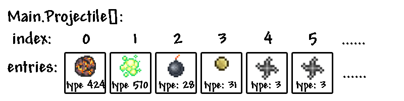

错误示例：

```cs
// ProjectileID.Shuriken 是“手里剑这种弹幕”的 Type，
// 不是 Main.projectile 数组里某枚手里剑的位置。
Projectile p = Main.projectile[ProjectileID.Shuriken];
```

### 1.7 坐标与时间

坐标系：

- 世界坐标以像素为单位，通常是 `Vector2`；玩家、NPC、弹幕都使用它。
- Tile 坐标以 16×16 像素网格为单位，通常是整数 `Point`/`Point16`。
- 屏幕坐标用于 UI 和绘制。将世界坐标绘制到屏幕时通常需要减去 `Main.screenPosition`。
- X 向右增大，Y 向下增大。

常用转换：

```cs
Point tilePos = player.Center.ToTileCoordinates();
Vector2 tileCenter = tilePos.ToWorldCoordinates();
Vector2 screenPos = worldPos - Main.screenPosition;
```

时间：Terraria 目标逻辑速度是每秒 60 tick。玩法计时优先使用 tick，不要用 `Thread.Sleep`、`System.Timers` 或忙等待循环。

```cs
private int cooldown;

public override void AI()
{
    if (cooldown > 0)
        cooldown--;

    if (cooldown == 0)
    {
        // 执行动作
        cooldown = 60; // 约 1 秒
    }
}
```

弹幕和 NPC 的 `ai[]` 常被用作自动同步的计时器/状态槽，但要先确认所使用的原版 AI 没占用它。

### 本章完成标准

你应该能口头解释：为什么“剑 Item 发射 Projectile”“工作台配方要求 Tile”“`ProjectileID` 不能当作 `Main.projectile[]` 下标”。解释不清时先别急着写 Boss。

---

<a id="chapter-2"></a>

## 第 2 章：第一个纵向切片——材料、武器、配方、本地化

接下来做一个小闭环：恶魔眼掉落“星屑碎片”，碎片合成“星屑刃”，星屑刃发射弹幕。先实现材料和武器，弹幕与掉落在后续章节补上。

示例使用 `LearningMod` 命名空间。请替换成你的真实内部名，并为每个内容类添加同路径、同文件名的 PNG：

```text
Content/Items/Materials/StarShard.cs
Content/Items/Materials/StarShard.png
Content/Items/Weapons/ShardBlade.cs
Content/Items/Weapons/ShardBlade.png
```

### 2.1 材料物品

```cs
using Terraria;
using Terraria.ID;
using Terraria.ModLoader;

namespace LearningMod.Content.Items.Materials;

public class StarShard : ModItem
{
    public override void SetDefaults()
    {
        Item.width = 18;
        Item.height = 18;
        Item.maxStack = Item.CommonMaxStack;
        Item.value = Item.sellPrice(silver: 2);
        Item.rare = ItemRarityID.Blue;
    }
}
```

`width/height` 是物品在世界中作为掉落物时的碰撞尺寸，不等同于 PNG 尺寸。`value` 是铜币单位，使用 `Item.sellPrice` 比手算更清楚。

### 2.2 武器物品

先让它作为普通近战剑工作。第 3 章再接入 `ShardBolt`。

```cs
using LearningMod.Content.Items.Materials;
using Terraria;
using Terraria.ID;
using Terraria.ModLoader;

namespace LearningMod.Content.Items.Weapons;

public class ShardBlade : ModItem
{
    public override void SetDefaults()
    {
        Item.width = 40;
        Item.height = 40;

        Item.damage = 24;
        Item.DamageType = DamageClass.Melee;
        Item.knockBack = 5f;
        Item.crit = 4;

        Item.useStyle = ItemUseStyleID.Swing;
        Item.useTime = 22;
        Item.useAnimation = 22;
        Item.autoReuse = true;
        Item.UseSound = SoundID.Item1;

        Item.value = Item.buyPrice(silver: 80);
        Item.rare = ItemRarityID.Blue;
    }

    public override void AddRecipes()
    {
        CreateRecipe()
            .AddIngredient<StarShard>(8)
            .AddIngredient(ItemID.FallenStar, 2)
            .AddTile(TileID.Anvils)
            .Register();
    }
}
```

值得理解的字段：

- `damage`：基础伤害。
- `DamageType`：近战、远程、魔法、召唤等伤害职业。
- `useTime`：两次实际使用之间的 tick 间隔。
- `useAnimation`：一次使用动画持续时间。两者不同时会影响连发次数与节奏。
- `useStyle`：持握/挥动方式。
- `UseSound`：使用音效。
- `shoot`、`shootSpeed`：第 3 章用于连接弹幕。

### 2.3 配方的四个动作

配方永远可以拆成四步：创建结果、添加材料、添加制作站、注册。

```cs
CreateRecipe(结果数量)
    .AddIngredient(材料 Type, 数量)
    .AddTile(制作站 Tile Type)
    .Register();
```

要分清原版与模组内容：

```cs
recipe.AddIngredient(ItemID.Wood);                 // 原版物品
recipe.AddIngredient<StarShard>(5);                // 本模组物品
recipe.AddTile(TileID.WorkBenches);                // 原版方块
recipe.AddTile<ShardWorkbenchTile>();              // 本模组方块
```

液体不是 Tile，使用条件：

```cs
recipe.AddCondition(Condition.NearWater);
recipe.AddCondition(Condition.NearLava);
recipe.AddCondition(Condition.NearHoney);
recipe.AddCondition(Condition.NearShimmer);
```

“任意木材”“铁锭或铅锭”一类需求应使用 Recipe Group；修改原版配方、微光分解和自定义消耗放到掌握基础后再学。

### 2.4 本地化，不要把玩家可见文本写死在 C# 里

新内容在成功加载后会自动补全本地化键。简体中文文件名使用 `zh-Hans`。示例：

```hjson
Mods: {
    LearningMod: {
        Items: {
            StarShard: {
                DisplayName: 星屑碎片
                Tooltip: 微微闪烁的奇异碎片
            }
            ShardBlade: {
                DisplayName: 星屑刃
                Tooltip: 挥动时释放一枚星屑弹
            }
        }
    }
}
```

文件可命名为 `Localization/zh-Hans_Mods.LearningMod.hjson`。工作流是：

1. 新增内容类。
2. 构建并加载一次，让 tModLoader 生成缺失键。
3. 编辑 `.hjson`。
4. 再次构建并重载，检查显示。

不要再使用旧教程中的 `DisplayName.SetDefault(...)` 或 `Tooltip.SetDefault(...)`；1.4.4 系列已将本地化放入 HJSON。

### 2.5 常见错误

- `ItemID` 中找不到你的物品：你把模组物品当成原版 ID 了，改用泛型或 `ModContent.ItemType<T>()`。
- 配方不出现：检查 `AddRecipes` 是否确实 `override`，最后是否调用 `Register()`。
- 材料和制作站显示错位：常见原因是把 `ItemID` 传给 `AddTile`，或把 `TileID` 传给 `AddIngredient`。
- `MissingResourceException`：PNG 路径、文件名、大小写或命名空间不匹配。
- 重命名类后物品变成 Unloaded Item：发布后的内部名是存档协议的一部分；确需改名时使用 `[LegacyName("OldClassName")]` 并测试迁移。

### 本章练习

1. 修改星屑刃的伤害、速度、稀有度，观察体验差异。
2. 再添加一个纯材料物品，并让配方接受两种材料。
3. 为中英文分别写本地化，不在 C# 中留下玩家可见字符串。

完成标准：物品可获取、配方可见、中文名与 Tooltip 正常、重新加载无报错。

---

<a id="chapter-3"></a>

## 第 3 章：弹幕——从“复制原版行为”到自己的 AI

### 3.1 先连接 Item 和 Projectile

创建：

```text
Content/Projectiles/ShardBolt.cs
Content/Projectiles/ShardBolt.png
```

```cs
using Microsoft.Xna.Framework;
using Terraria;
using Terraria.ID;
using Terraria.ModLoader;

namespace LearningMod.Content.Projectiles;

public class ShardBolt : ModProjectile
{
    public override void SetDefaults()
    {
        Projectile.width = 12;
        Projectile.height = 12;
        Projectile.friendly = true;
        Projectile.hostile = false;
        Projectile.DamageType = DamageClass.Melee;
        Projectile.penetrate = 1;
        Projectile.timeLeft = 300;
        Projectile.tileCollide = true;
        Projectile.ignoreWater = false;
    }

    public override void AI()
    {
        Projectile.rotation = Projectile.velocity.ToRotation();

        if (Projectile.timeLeft < 270)
            Projectile.velocity.Y += 0.08f;

        if (Main.rand.NextBool(3))
        {
            Dust dust = Dust.NewDustDirect(
                Projectile.position,
                Projectile.width,
                Projectile.height,
                DustID.BlueTorch);
            dust.noGravity = true;
            dust.velocity *= 0.2f;
        }
    }

    public override void OnHitNPC(NPC target, NPC.HitInfo hit, int damageDone)
    {
        target.AddBuff(BuffID.OnFire, 120);
    }
}
```

在 `ShardBlade.cs` 顶部添加命名空间：

```cs
using LearningMod.Content.Projectiles;
```

并在 `SetDefaults` 中加入：

```cs
Item.shoot = ModContent.ProjectileType<ShardBolt>();
Item.shootSpeed = 9f;
```

这里的关键不是背代码，而是看清连接关系：`ModContent.ProjectileType<ShardBolt>()` 将自定义内容类转成游戏需要的 Type。

### 3.2 `Projectile.damage` 为什么通常不写在 `SetDefaults`

弹幕生成时，伤害由 `Projectile.NewProjectile` 或武器发射流程传入，会覆盖弹幕默认伤害。因此通常由发射它的 Item/NPC 决定伤害，不要指望在 `ModProjectile.SetDefaults` 中设置 `Projectile.damage`。

### 3.3 原版 AI 是原型工具

最省力的试验方式是复制接近目标的原版弹幕默认值，并指定 `AIType`：

```cs
public override void SetDefaults()
{
    Projectile.CloneDefaults(ProjectileID.EnchantedBoomerang);
    AIType = ProjectileID.EnchantedBoomerang;
}
```

这适合快速验证“回旋镖是否好玩”。一旦需要改动核心运动、状态切换或联机行为，通常应阅读原版实现并写自己的 `AI()`，而不是与 `aiStyle` 较劲。

### 3.4 自定义 AI 的积木

- 计时：字段、`Projectile.ai[0..2]`、`timeLeft`。
- 重力：逐 tick 增加 `velocity.Y`，并限制终端速度。
- 朝向：`Projectile.rotation = Projectile.velocity.ToRotation()`。
- 追踪：选定有效 NPC，逐步把速度插值到目标方向。
- 状态机：用 `ai[0]` 表示状态、`ai[1]` 表示状态内计时。
- 动画：`Main.projFrames[Type]`、`frame`、`frameCounter`。
- 命中：`OnHitNPC`、`ModifyHitNPC`。
- 碰墙：`OnTileCollide`。
- 死亡：`OnKill`。
- 绘制：`PreDraw` / `PostDraw`，只负责视觉，不承载玩法逻辑。

一个更易读的状态槽写法：

```cs
private ref float Timer => ref Projectile.ai[0];
private ref float State => ref Projectile.ai[1];
```

使用 `ai[]` 的好处是它们随实体同步；代价是可读性差，所以最好包成具名属性，并记录每个槽的用途。

### 3.5 弹幕生成要携带来源

当前 API 要求 `IEntitySource`，它记录“为什么生成这个实体”，让伤害、旗帜、来源判断和其他模组兼容得以工作。

在 `ModItem.Shoot` 中直接使用传入的 `source`：

```cs
public override bool Shoot(
    Player player,
    Terraria.DataStructures.EntitySource_ItemUse_WithAmmo source,
    Vector2 position,
    Vector2 velocity,
    int type,
    int damage,
    float knockback)
{
    Projectile.NewProjectile(source, position, velocity, type, damage, knockback, player.whoAmI);
    return false; // 已手动生成，阻止默认再生成一次
}
```

其他常见来源：

- NPC AI：`NPC.GetSource_FromAI()`。
- 弹幕派生弹幕：`Projectile.GetSource_FromThis()`。
- NPC 掉落：优先使用掉落规则；特殊情况使用 `NPC.GetSource_Loot()`。
- Tile 破坏：`WorldGen.GetItemSource_FromTileBreak(i, j)`。

不要把 `IEntitySource` 长期存进字段；它只描述生成瞬间。

### 3.6 碰撞箱与图片不是一回事

`Projectile.width/height` 是碰撞箱，PNG 是视觉。细长弹幕通常使用较小、近似方形的碰撞箱，然后调整绘制原点。不要为了让图片看起来对齐就把碰撞箱设成整张长图的尺寸。

原 Wiki 用这张图解释横向弹幕的绘制偏移：

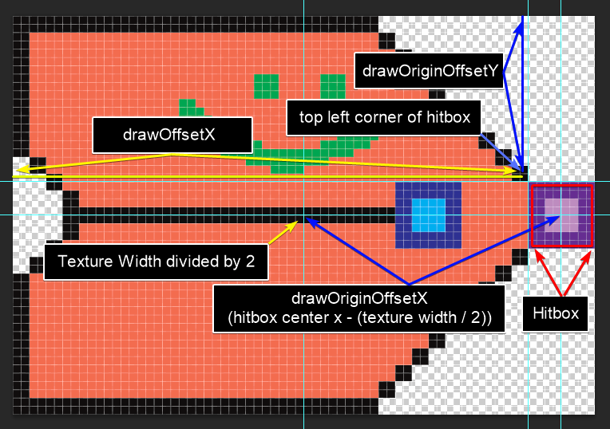

开发时可用 Modders Toolkit 显示碰撞箱。常见字段是 `DrawOffsetX`、`DrawOriginOffsetX`、`DrawOriginOffsetY`。如果默认绘制实在难以控制，再在 `PreDraw` 中自己绘制。

拖尾通常通过 `Projectile.oldPos` 记录历史位置，并从旧到新绘制透明度递增的副本：

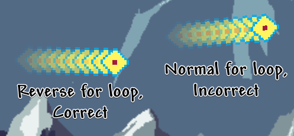

### 3.7 联机底线

如果弹幕由玩家拥有，并在 `AI` 中读取鼠标或做只应发生一次的随机决策，必须明确所有权：

```cs
if (Projectile.owner == Main.myPlayer)
{
    // 读取本地玩家鼠标，或生成只应由 owner 生成的子弹幕
    Projectile.netUpdate = true;
}
```

不要把这条规则机械套到所有逻辑；第 10 章会解释服务端、客户端和 owner。当前只需记住：**“每台机器都会跑一次”的 Hook 里生成实体，很容易复制出多份。**

### 本章练习

1. 让星屑弹飞行 0.5 秒后开始下坠。
2. 每三次命中才施加一次 Debuff，思考计数应放在哪里。
3. 做一个使用 `CloneDefaults + AIType` 的回旋镖原型，再做一个完全自定义版本。
4. 开两个客户端测试是否出现双重弹幕或位置跳变。

---

<a id="chapter-4"></a>

## 第 4 章：NPC——生成、行为和掉落

### 4.1 先做普通敌怪，不要以 Boss 起步

普通敌怪已经会涉及贴图帧、生命、伤害、防御、击退抗性、AI、生成条件、掉落和联机同步。Boss 还会额外引入多阶段状态机、场地、音乐、Boss Bar、战利品袋、世界进度与大量边界情况。

初学时可以先复制接近目标的原版 NPC：

```cs
public override void SetDefaults()
{
    NPC.CloneDefaults(NPCID.BlueSlime);
    AIType = NPCID.BlueSlime;
    AnimationType = NPCID.BlueSlime;

    NPC.lifeMax = 80;
    NPC.damage = 18;
    NPC.defense = 6;
    NPC.value = Item.buyPrice(silver: 1);
}
```

这与弹幕相同：先用原版行为验证美术和数值，再决定是否值得写自定义 AI。

### 4.2 生成概率返回 `float`

`SpawnChance` 不是“是否生成”的布尔值，而是相对于同环境其他候选 NPC 的权重。

```cs
public override float SpawnChance(NPCSpawnInfo spawnInfo)
{
    if (!Main.dayTime && spawnInfo.Player.ZoneOverworldHeight)
        return 0.08f;

    return 0f;
}
```

生成逻辑使用 `spawnInfo.Player`，不要用 `Main.LocalPlayer`。服务端没有“你的本地玩家”这一概念。

世界高度与预定义 Zone 的关系可参考原图。注意 Y 从天空向下增大。

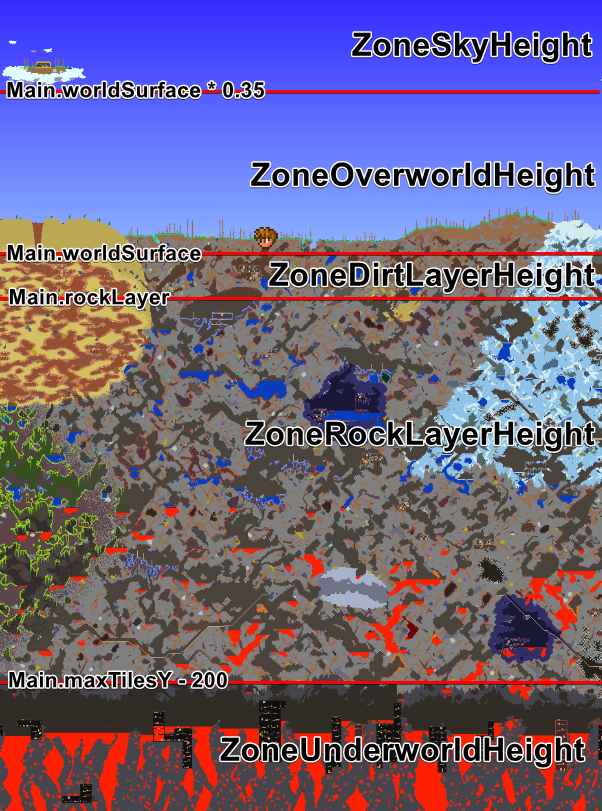

组合条件时先写清楚布尔变量，比一口气堆十个 `&&` 更容易验证：

```cs
bool correctHeight = spawnInfo.Player.ZoneRockLayerHeight;
bool correctTime = !Main.dayTime;
bool safeArea = !spawnInfo.Player.ZoneTown;

return correctHeight && correctTime && safeArea ? 0.12f : 0f;
```

### 4.3 自定义 AI：用状态机，不用一团 if

推荐把 `NPC.ai[0]` 当作状态、`NPC.ai[1]` 当作计时器，并定义枚举：

```cs
private enum ActionState
{
    Idle,
    Chase,
    Attack
}

private ref float State => ref NPC.ai[0];
private ref float Timer => ref NPC.ai[1];
```

每个状态只做三件事：进入时初始化、状态内更新、满足条件时切换。发生非确定性选择（随机目标、随机攻击分支）时，应由服务端决定并设置 `NPC.netUpdate = true`。

### 4.4 给自定义 NPC 加掉落

```cs
using LearningMod.Content.Items.Materials;
using Terraria.GameContent.ItemDropRules;

public override void ModifyNPCLoot(NPCLoot npcLoot)
{
    npcLoot.Add(ItemDropRule.Common(
        ModContent.ItemType<StarShard>(),
        chanceDenominator: 2,
        minimumDropped: 1,
        maximumDropped: 3));
}
```

`chanceDenominator: 2` 表示 1/2。掉落 10～15 个、概率 1/4 的形式是：

```cs
ItemDropRule.Common(itemType, 4, 10, 15)
```

### 4.5 修改原版 NPC 掉落，完成纵向切片

创建 `Common/GlobalNPCs/ShardLootGlobalNPC.cs`：

```cs
using LearningMod.Content.Items.Materials;
using Terraria;
using Terraria.GameContent.ItemDropRules;
using Terraria.ID;
using Terraria.ModLoader;

namespace LearningMod.Common.GlobalNPCs;

public class ShardLootGlobalNPC : GlobalNPC
{
    public override void ModifyNPCLoot(NPC npc, NPCLoot npcLoot)
    {
        if (npc.type == NPCID.DemonEye)
        {
            npcLoot.Add(ItemDropRule.Common(
                ModContent.ItemType<StarShard>(),
                chanceDenominator: 5,
                minimumDropped: 1,
                maximumDropped: 2));
        }
    }
}
```

此时学习闭环成立：夜晚击杀恶魔眼 → 获得星屑碎片 → 在铁砧合成星屑刃 → 发射自定义弹幕。

复杂掉落用 `LeadingConditionRule`、`OnSuccess`、`OnFailedRoll` 等规则组合。Boss 在专家模式通常掉落每人一份 Boss Bag，普通模式才直接掉装备；不要把两套规则同时添加。

### 4.6 常见 NPC 故障

- 自定义 NPC 立刻消失：检查 `SpawnChance`、活动范围、AI 是否意外设置 `active = false` 或异常移动。
- Hardmode 数值异常增大：某些字段会受原版缩放；先对照相似 ExampleMod NPC。
- NPC 发射的弹幕伤害为 0 或异常：区分友方/敌方、难度伤害缩放，并由 NPC 侧传入正确伤害。
- 多人游戏瞬移：通常是客户端各自做随机决策，却没由服务端同步。
- 掉落条件似乎无效：检查是否把链式子规则又直接 `npcLoot.Add` 了一遍。

### 本章完成标准

普通敌怪能稳定生成、行为可预测、掉落符合概率；两客户端观察到的状态一致。做到这里，再考虑第一个小 Boss。

---

<a id="chapter-5"></a>

## 第 5 章：玩家效果——`ModPlayer` 的“如果 X，就 Y”模式

`ModPlayer` 为每个 `Player` 自动附加一个实例。它适合保存玩家特有的字段，并在玩家相关 Hook 中实现效果。

最常见的模式是：

1. `ModPlayer` 中有一个字段表示效果是否启用。
2. `ResetEffects` 每 tick 把它重置为默认值。
3. 饰品、Buff、护甲等内容在自己的更新 Hook 中把字段设为 `true`。
4. `ModPlayer` 的命中、受伤或更新 Hook 根据该字段执行效果。

### 5.1 一个完整的饰品效果

```cs
using Terraria;
using Terraria.ID;
using Terraria.ModLoader;

namespace LearningMod.Common.Players;

public class ShardPlayer : ModPlayer
{
    public bool BurningShardEffect;

    public override void ResetEffects()
    {
        BurningShardEffect = false;
    }

    public override void OnHitNPCWithProj(
        Projectile proj,
        NPC target,
        NPC.HitInfo hit,
        int damageDone)
    {
        if (BurningShardEffect && proj.friendly)
            target.AddBuff(BuffID.OnFire, 180);
    }
}
```

饰品中只负责启用能力：

```cs
public override void UpdateAccessory(Player player, bool hideVisual)
{
    player.GetModPlayer<ShardPlayer>().BurningShardEffect = true;
}
```

为什么不把完整命中逻辑全写在饰品类里？因为以后升级饰品、Buff 或套装也可以启用同一能力，不必复制一份战斗逻辑。

### 5.2 为什么每 tick 重置

Terraria 的许多属性和装备效果每 tick 重新计算。饰品只要持续装备，就会每 tick 再次把开关设为 `true`；一旦卸下，下一个 tick 的 `ResetEffects` 会恢复 `false`。如果不重置，效果可能在卸下装备后永久残留。

同类模式也适用于数值，但优先使用 `StatModifier` 等 API：

```cs
public override void PostUpdateEquips()
{
    // 根据状态修改玩家能力；具体字段应以当前 API 文档为准。
}
```

### 5.3 一个 `ModPlayer` 只负责一个领域

可以拥有多个 `ModPlayer`，而且通常应该如此。例如：

- `CombatPlayer`：伤害、暴击、受击效果。
- `QuestPlayer`：个人任务进度。
- `MovementPlayer`：冲刺、跳跃、移动状态。
- `ResourcePlayer`：自定义能量。

不要把钓鱼、任务、战斗、UI、网络全塞进 `MyPlayer.cs`。类名应说明职责。

### 5.4 临时状态、玩家存档与世界存档

| 数据 | 放在哪里 | 是否保存 |
| --- | --- | --- |
| 饰品当前是否装备 | `ModPlayer` 字段 + `ResetEffects` | 否 |
| 玩家永久吃过几颗强化果 | `ModPlayer` | 是，`SaveData/LoadData` |
| 这个世界是否击败某 Boss | `ModSystem` | 是，`SaveWorldData/LoadWorldData` |
| 某个独立物品的随机词条 | `ModItem` / `GlobalItem` 实例 | 是 |
| 某台机器库存与进度 | `ModTileEntity` | 是并需联机同步 |

完成标准：卸下饰品后效果立刻消失；重新进入世界不会出现状态串到别的玩家或别的世界。

---

<a id="chapter-6"></a>

## 第 6 章：保存与加载——`TagCompound`

`TagCompound` 可以理解成支持嵌套和多种 Terraria 类型的键值容器。它用于 `ModPlayer`、`ModSystem`、`ModItem`、`ModNPC`、`GlobalItem`、`GlobalNPC` 和 `ModTileEntity` 的自定义存档。

### 6.1 玩家数据最小示例

```cs
using Terraria.ModLoader;
using Terraria.ModLoader.IO;

namespace LearningMod.Common.Players;

public class ProgressPlayer : ModPlayer
{
    public int ShardsConsumed;

    public override void Initialize()
    {
        ShardsConsumed = 0;
    }

    public override void SaveData(TagCompound tag)
    {
        tag["shardsConsumed"] = ShardsConsumed;
    }

    public override void LoadData(TagCompound tag)
    {
        ShardsConsumed = tag.GetInt("shardsConsumed");
    }
}
```

缺失的整数键会得到 `0`，因此这个默认值天然兼容旧存档。如果新版本希望缺失时默认为 10：

```cs
public override void Initialize()
{
    ShardsConsumed = 10;
}

public override void LoadData(TagCompound tag)
{
    if (tag.ContainsKey("shardsConsumed"))
        ShardsConsumed = tag.GetInt("shardsConsumed");
}
```

### 6.2 世界数据必须在切换世界时清空

```cs
using Terraria.ModLoader;
using Terraria.ModLoader.IO;

namespace LearningMod.Common.Systems;

public class DownedBossSystem : ModSystem
{
    public static bool DownedShardGuardian;

    public override void ClearWorld()
    {
        DownedShardGuardian = false;
    }

    public override void SaveWorldData(TagCompound tag)
    {
        if (DownedShardGuardian)
            tag["downedShardGuardian"] = true;
    }

    public override void LoadWorldData(TagCompound tag)
    {
        DownedShardGuardian = tag.GetBool("downedShardGuardian");
    }
}
```

如果忘记 `ClearWorld`，从世界 A 退出再进入尚无存档键的世界 B 时，静态字段可能沿用 A 的值。

### 6.3 直接保存受支持的类型

不要把列表拆成 `stats_0`、`stats_1`、`stats_2`。这会让数据难以迁移和检查。

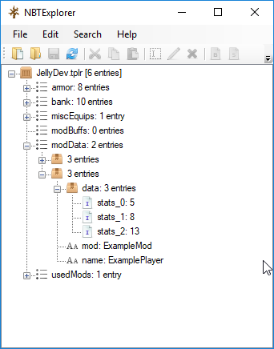

直接保存列表：

```cs
tag["stats"] = stats;
stats = tag.GetList<int>("stats");
```

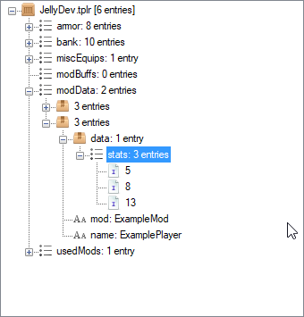

原生支持常见基本类型、数组/列表、`Vector2`、`Color`、`Rectangle`、`Item`、`Point16` 和各种 `EntityDefinition`。如果只需保存“某一种物品的身份”，使用 `ItemDefinition`，不要直接保存 `Item.type`；模组列表或注册顺序变化后，模组 Type 数字可能变化。

### 6.4 存档键是协议

发布后，键名、类型和类内部名都是用户存档的一部分：

- 改字段名但保留旧键名，存档可以继续读取。
- 使用 `nameof(Field)` 可减少拼写错误，但 IDE 重命名字段会顺便改变键，可能悄悄丢数据。
- 改已保存值的类型（如 `float` → `int`）需要兼容读取或迁移。
- 重命名内容类可用 `[LegacyName("OldName")]` 保留身份。

### 6.5 不要长期保存 `TagCompound` 对象本身

`TagCompound` 是保存/加载过程的传输容器。运行时字段应是有明确类型的 C# 数据；在 `SaveData` 中写入，在 `LoadData` 中恢复。不要把整个 `TagCompound` 留在字段里当数据库。

### 本章练习

1. 制作一次性消耗品，把永久使用次数存入 `ModPlayer`。
2. 制作一个世界级布尔进度，在两个世界之间来回切换验证不会串值。
3. 修改存档结构前，写下旧键、旧类型、新键、新类型和迁移策略。

---

<a id="chapter-7"></a>

## 第 7 章：Tile、Wall 与 Tile Entity

Tile 是这套 API 中最容易被像素尺寸、网格坐标、帧和放置规则绊倒的部分。先做 1×1 地形块，再做家具，最后才做拥有独立状态的机器。

### 7.1 地形 Tile 与 FrameImportant Tile

地形块会根据相邻同类方块自动选择贴图区域：

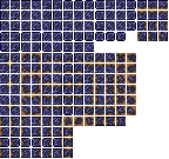

家具等 FrameImportant Tile 的外观通常固定，并可能占据多个格子：

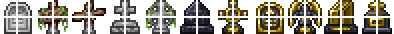

它们的关键区别：

- 地形 Tile 通常 1×1，依赖自动 framing 与合并规则。
- 家具/多格 Tile 使用 `TileObjectData` 描述宽高、原点、每行高度、锚点、朝向和 style。
- 不是所有 1×1 Tile 都是地形；是否 `Main.tileFrameImportant[Type]` 才是判断依据。

### 7.2 先做一个可放置地形块

物品侧：

```cs
public override void SetDefaults()
{
    Item.DefaultToPlaceableTile(ModContent.TileType<ShardBlockTile>());
    Item.width = 16;
    Item.height = 16;
}
```

Tile 侧：

```cs
using Microsoft.Xna.Framework;
using Terraria;
using Terraria.ID;
using Terraria.ModLoader;

namespace LearningMod.Content.Tiles;

public class ShardBlockTile : ModTile
{
    public override void SetStaticDefaults()
    {
        Main.tileSolid[Type] = true;
        Main.tileBlockLight[Type] = true;
        Main.tileMergeDirt[Type] = true;

        MineResist = 1.5f;
        MinPick = 35;
        DustType = DustID.BlueCrystalShard;

        AddMapEntry(new Color(80, 140, 210));
    }
}
```

只设置偏离默认值的字段。需要桌子、门、椅子、平台等特殊行为时，优先找到最接近的 ExampleMod Tile，复制其 `SetStaticDefaults` 与 `TileObjectData` 骨架后再修改。

### 7.3 贴图的 16 与 18

世界里每个 Tile 占 16×16 像素，但很多 Tile spritesheet 在每个格子右侧和下方留 2 像素 padding，所以单元间距常为 18×18。贴图尺寸看起来“差两像素”通常不是玄学，是 padding。

### 7.4 多格家具与 Origin

`Origin` 表示玩家放置时鼠标对应家具中的哪一格。相同 3×2 家具，不同 Origin 会改变放置定位：

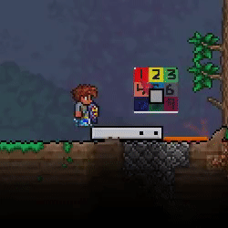

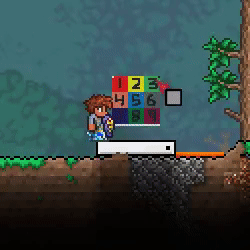

典型配置：

```cs
TileObjectData.newTile.CopyFrom(TileObjectData.Style2x2);
TileObjectData.newTile.Origin = new Point16(0, 1);
TileObjectData.newTile.CoordinateHeights = [16, 18];
TileObjectData.addTile(Type);
```

必须在 `TileObjectData.addTile(Type)` 之前完成修改。家具被破坏时应在 `KillMultiTile` 中处理对应掉落/Tile Entity 清理。

### 7.5 Tile Entity 什么时候需要

普通装饰和制作站不需要 Tile Entity。只有每个放置实例都拥有持续状态时才需要，例如：

- 独立库存。
- 制作进度或能量。
- 所有者、命名或升级数据。
- 每台机器不同的开关状态。

Tile Entity 通常需要同时实现：有效位置判断、保存加载、更新、放置/销毁和网络同步。它属于中级主题；如果只需要世界共享的一个布尔值，用 `ModSystem` 更合适。

### 7.6 运行时修改 Tile 要 framing 与同步

世界生成结束后会统一 framing；游戏运行中改 Tile 则要主动处理相邻 framing。联机时还必须由服务端修改并发送对应 Tile 区域，否则客户端看到的世界会分叉。

完成标准：方块可放置、可挖掘、地图颜色正确；多人加入后看到相同方块；家具从各方向放置和破坏都不残留幽灵格子。

---

<a id="chapter-8"></a>

## 第 8 章：世界生成——先小范围验证，再接入生成 Pass

世界生成由按顺序执行的 Pass 组成，一个 Pass 内可以有多个步骤。最常见入口是 `ModSystem.ModifyWorldGenTasks`，把自己的 `GenPass` 插到合适的原版 Pass 前后。

### 8.1 世界生成的四条安全规则

1. 所有 Tile 下标访问前保证坐标在世界内，常用 `WorldGen.InWorld(x, y, fluff)`。
2. 使用 `WorldGen.genRand`，不要随意混用客户端随机源。
3. 生成代码只负责创建世界；已生成的世界进度放 `SaveWorldData`。
4. 先测试一次方法调用，再测试一个完整 Pass，最后才生成整张世界。

```cs
if (!WorldGen.InWorld(x, y, 10))
    return;

Tile tile = Main.tile[x, y];
```

### 8.2 Framing 的视觉含义

未 framing 的相邻地形块会像重复的小方格：


framing 后才会连接成完整表面：

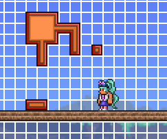

`TileFrameX` 与 `TileFrameY` 选择 spritesheet 中实际绘制的 16×16 区域：

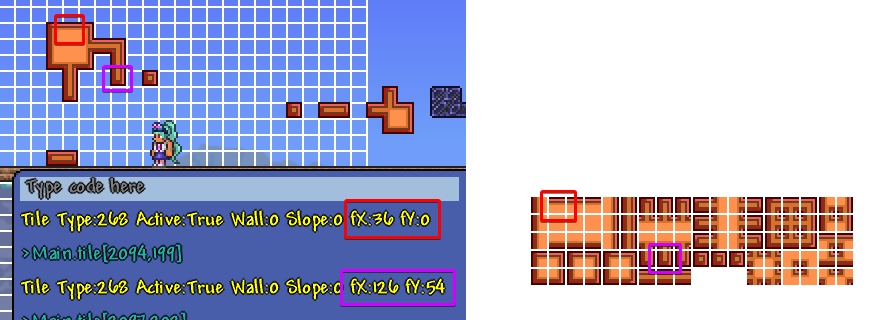

世界生成完成时游戏会统一 framing；在已运行的世界中修改方块，则需调用合适的 framing 与网络同步方法。

### 8.3 最小矿脉 Pass

下面只展示结构。Pass 名称和插入位置应根据当前稳定版原版任务列表确认，不要永久依赖硬编码索引。

```cs
using System.Collections.Generic;
using Terraria;
using Terraria.GameContent.Generation;
using Terraria.IO;
using Terraria.ModLoader;
using Terraria.WorldBuilding;

namespace LearningMod.Common.Systems;

public class ShardWorldGenSystem : ModSystem
{
    public override void ModifyWorldGenTasks(
        List<GenPass> tasks,
        ref double totalWeight)
    {
        int index = tasks.FindIndex(pass => pass.Name == "Shinies");
        if (index == -1)
            return;

        tasks.Insert(index + 1, new PassLegacy(
            "Learning Mod: Star Shards",
            GenerateShardOre));
    }

    private void GenerateShardOre(GenerationProgress progress, GameConfiguration configuration)
    {
        progress.Message = "星屑正在地底凝结";

        int attempts = (int)(Main.maxTilesX * Main.maxTilesY * 0.00004f);
        for (int k = 0; k < attempts; k++)
        {
            int x = WorldGen.genRand.Next(100, Main.maxTilesX - 100);
            int y = WorldGen.genRand.Next((int)Main.rockLayer, Main.maxTilesY - 200);

            WorldGen.TileRunner(
                x,
                y,
                WorldGen.genRand.Next(3, 7),
                WorldGen.genRand.Next(3, 8),
                ModContent.TileType<ShardBlockTile>());
        }
    }
}
```

这段代码的目标是示范结构，不是提供平衡好的矿物分布。实际开发要测试小、中、大世界的数量、深度、与结构重叠、生成耗时和卸载模组后的后果。

### 8.4 快速迭代而不是反复造世界

原 Wiki 建议使用调试器配合 HEROs Mod 与 Modders Toolkit，在废弃测试世界中：

- 禁用敌怪、开启照明/无敌和地图。
- 在鼠标指向位置手动触发一小段世界生成代码。
- 用 Dust 标记坐标。
- 生成前做世界快照，测试后恢复。
- 用断点和热重载调整参数。

它的双窗口调试布局如下：


这套方法的核心是“缩短反馈回路”。像 `TileRunner`、`DigTunnel` 这种参数不够直观的方法，应先在鼠标位置调用一次，观察半径和方向，再放进正式 Pass。

### 8.5 暂时不要做的事

- 不要一开始重写整套原版世界生成。
- 不要扫描整张世界的每一格并在每 tick 重复执行。
- 不要用世界坐标直接索引 `Main.tile[,]`。
- 不要在客户端单独修改世界。
- 不要假设某个 Pass 的数字位置永远不变；按名称查找并处理找不到的情况。

完成标准：生成时间可接受；三种世界尺寸均能生成目标内容；坐标不越界；重进世界后进度正确；联机客户端看到相同结果。

---

<a id="chapter-9"></a>

## 第 9 章：资源、声音、配置与 UI

这四类内容共同的特点是：很容易在单机看起来正常，却在专用服务器、不同分辨率或资源加载时机上出问题。

### 9.1 资源加载：保存 `Asset<T>`，不要每帧 Request

tModLoader 使用 `Asset<T>` 处理纹理、Shader、字体和声音，支持异步加载与资源包覆盖。

```cs
using Microsoft.Xna.Framework.Graphics;
using ReLogic.Content;

private static Asset<Texture2D> glowTexture;

public override void Load()
{
    glowTexture = Mod.Assets.Request<Texture2D>(
        "Content/Projectiles/ShardBolt_Glow");
}
```

绘制时才取 `.Value`：

```cs
Main.EntitySpriteDraw(
    glowTexture.Value,
    drawPosition,
    sourceRectangle,
    Color.White,
    rotation,
    origin,
    scale,
    effects,
    0f);
```

规则：

- 字段保存 `Asset<Texture2D>`，不要只保存 `Texture2D`。
- 在 `Load` / `SetStaticDefaults` 请求额外资源，让拼写错误尽早暴露。
- 不要在 `AI`、`Draw` 等每 tick Hook 中反复 `Request`。
- 默认异步加载通常足够；滥用 `AssetRequestMode.ImmediateLoad` 会卡顿。
- 专用服务器不加载图形资源，客户端 UI/绘制系统应明确标为客户端侧。

如果某个 UI 布局必须立刻读取纹理宽高，才考虑加载期预取或少量 `ImmediateLoad`。

### 9.2 声音

播放预定义音效：

```cs
using Terraria.Audio;
using Terraria.ID;

SoundEngine.PlaySound(SoundID.Item9, Projectile.Center);
```

`SoundStyle` 可以控制音量、音高、随机音高、最大实例、循环和变体。声音路径不写扩展名，实际文件应符合 tModLoader 支持的 PCM/OGG/WAV 约束。

不要每 tick 无条件播放音效；使用状态进入、冷却或 `soundDelay`。循环声音还要在实体消失、离开世界或条件结束时停止。

### 9.3 配置

`ModConfig` 字段会自动生成配置 UI，并序列化成 JSON。配置文件通常只记录偏离默认值的项目，因此看到 `{}` 不代表没有生效。

```cs
using System.ComponentModel;
using Terraria.ModLoader.Config;

namespace LearningMod.Common.Configs;

public class LearningClientConfig : ModConfig
{
    public override ConfigScope Mode => ConfigScope.ClientSide;

    [DefaultValue(true)]
    public bool ShowExtraParticles;

    [Range(0.25f, 2f)]
    [Increment(0.05f)]
    [DefaultValue(1f)]
    public float ParticleDensity;
}
```

- `ClientSide`：纯视觉、UI、音量等只影响本机的选项。
- `ServerSide`：影响玩法与世界规则；多人时由服务器配置主导。

不要把决定伤害、掉率的设置做成每个客户端各自不同的 ClientSide 配置。

### 9.4 UI 的三层结构

原 Wiki 用这张图概括 UI：元素放进 `UIState`，`UserInterface` 管理状态，`ModSystem` 更新并插入绘制层。

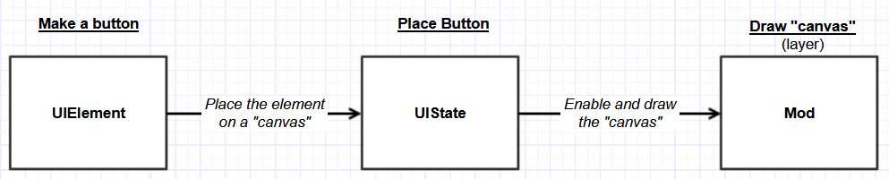

基本组成：

1. `UIElement` 或其子类：按钮、图片、文本、面板。
2. `UIState`：组合与布局元素。
3. `UserInterface`：保存当前 State、分发输入与 Update。
4. 客户端 `ModSystem`：在 `UpdateUI` 更新，在 `ModifyInterfaceLayers` 绘制。

原页面最终绘制出的按钮：

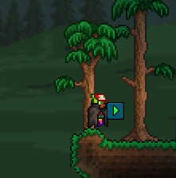

但该 Wiki 基础 UI 页的部分示例年代较早，甚至在正文中标明作者并不完全理解某段代码。请把它当作“理解对象关系”的图解，不要整页照抄。实际实现优先查看 [ExampleCoinsUI](https://github.com/tModLoader/tModLoader/tree/stable/ExampleMod/Common/UI/ExampleCoinsUI) 与当前 API。

UI 系统应限制在客户端：

```cs
[Autoload(Side = ModSide.Client)]
public class ShardUISystem : ModSystem
{
    // Load / UpdateUI / ModifyInterfaceLayers
}
```

还要处理：

- 鼠标悬停 UI 时阻止物品使用。
- 滚轮停在 UI 上时阻止热键栏切换。
- 使用 UI 坐标，不把世界坐标直接拿来绘制。
- 分辨率和 UI Scale 改变后仍正确布局。
- 关闭世界或卸载模组后不保留无效状态。

### 9.5 本地化进阶

所有玩家可见文本都应本地化，包括配置标签、按钮、死亡信息、任务文本和聊天消息。动态文本使用占位符与 `Language.GetTextValue`，不要把句子拆成无法调整语序的字符串拼接。

```cs
string message = Terraria.Localization.Language.GetTextValue(
    "Mods.LearningMod.Messages.ShardsCollected",
    amount);
```

HJSON：

```hjson
Messages: {
    ShardsCollected: 已收集 {0} 个星屑碎片
}
```

如果文本要通过网络发送，使用 `NetworkText` 等适合联机的机制，让每个客户端按自己的语言显示。

完成标准：专用服务器能加载模组；UI 在多分辨率下可用；客户端配置不影响服务端玩法；资源不会每帧重复加载。

---

<a id="chapter-10"></a>

## 第 10 章：多人联机——从第一周开始测试

联机兼容不是发布前最后加的一层胶带。NPC、弹幕、玩家字段、世界状态和 Tile Entity 各自有不同所有权，越晚处理越难重构。

### 10.1 基本拓扑

客户端之间不直接通信。客户端把信息发给服务端，由服务端验证、更新权威状态，再转发给其他客户端。

| 对象/行为 | 通常的权威方 | 常用同步方式 |
| --- | --- | --- |
| NPC | 服务端 | 原生字段 + `netUpdate`；额外字段用 `SendExtraAI/ReceiveExtraAI` |
| 玩家发射的 Projectile | owner 客户端，服务端转发 | 原生字段 + `netUpdate`；额外 AI 同步 |
| NPC/世界发射的 Projectile | 服务端 | 同上 |
| 世界级 `ModSystem` 数据 | 服务端 | `NetSend/NetReceive`，必要时发送 `MessageID.WorldData` |
| `ModPlayer` 自定义字段 | 取决于字段含义 | `SyncPlayer`、`CopyClientState`、`SendClientChanges` 与 ModPacket |
| `ModTileEntity` | 服务端 | `NetSend/NetReceive` 与 Tile Entity 消息 |
| UI、绘制、鼠标悬停 | 客户端 | 不应作为权威玩法状态 |

### 10.2 `Main.netMode` 与 owner 检查

```cs
if (Main.netMode != NetmodeID.MultiplayerClient)
{
    // 只在单机/服务端执行权威世界修改
}

if (Main.netMode == NetmodeID.Server)
{
    // 仅专用/联机服务端
}

if (Projectile.owner == Main.myPlayer)
{
    // 仅弹幕 owner 的本地客户端
}
```

这三种检查不是互换的。先问“谁应当决定这件事”，再选检查。

### 10.3 哪些数据已自动同步

- NPC 的位置、生命和许多原生字段会在 NPC 同步时发送。
- Projectile 的位置、速度、`ai[]` 等常见字段有内置同步。
- 原版 Player 的位置、生命、物品栏等已有同步流程。
- 装备效果会在各客户端根据装备重新计算，通常不必同步一个“饰品已生效”布尔值。

但你新增的普通 C# 字段不会凭空同步。需要所有机器共同参与逻辑的字段，必须放进对应的额外同步 Hook 或 ModPacket。

### 10.4 随机数导致的 NPC 瞬移

如果 NPC 的 `AI()` 在服务端和各客户端分别调用随机数选择方向，每台机器会得到不同决定。随后服务端同步位置，客户端会看到 NPC 突然纠正/瞬移。

正确思路：

```cs
if (Main.netMode != NetmodeID.MultiplayerClient)
{
    NPC.ai[2] = Main.rand.Next(3); // 服务端决定
    NPC.netUpdate = true;          // 把新状态同步出去
}
```

只同步结果，不要求每台机器“碰巧随机出一样的数”。

### 10.5 不要在绘制 Hook 中改变玩法

`PreDraw` 等 Hook 不在专用服务器运行。若你在绘制代码里改伤害、生成物品或推进 AI，服务器根本不会执行，客户端之间也会不一致。绘制只能读取玩法状态并展示。

### 10.6 本地双客户端测试

无需每次发布到创意工坊：

1. 启动第一个 tModLoader，Host & Play。
2. 从安装目录手动运行启动脚本，再开第二个客户端。
3. 第二个客户端通过 `localhost` 加入。
4. 同时观察两边的 NPC、弹幕、掉落、UI 与世界修改。
5. 需要调服务端代码时，从 IDE 选择 Terraria Server 启动目标，再让两个客户端连接。

建议从这些测试用例开始：

- 玩家 A 发射弹幕，A/B 各看到几枚？
- A 命中 NPC，B 看到的 Debuff 和生命是否一致？
- Boss 随机选招时两边动画是否一致？
- A 修改机器库存，B 是否立即看到？
- B 中途加入，能否收到完整世界状态？

完成标准：双客户端连续测试十分钟不出现复制掉落、双倍弹幕、NPC 瞬移、世界方块分叉或玩家字段回滚。

---

<a id="chapter-11"></a>

## 第 11 章：调试——从猜测升级为证据

### 11.1 第一步永远是隔离

出现 Bug 时：

1. 新角色、新世界复现。
2. 禁用除自己之外的所有模组。
3. 把触发步骤缩到最短。
4. 判断是构建错误、加载异常、运行异常，还是“能运行但逻辑不对”。
5. 联机问题同时检查 `client.log` 与 `server.log`。

若禁用其他模组后 Bug 消失，再逐个启用定位冲突。不要同时改五个地方然后祈祷。

### 11.2 三种调试层级

#### 临时游戏内文本

```cs
Main.NewText($"Timer={Timer}, State={State}");
```

原 Wiki 示例：

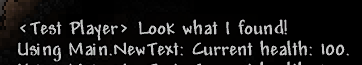

适合一眼看到少量值。确认问题后删除，避免把调试垃圾留给玩家。

#### 日志

```cs
Mod.Logger.Info($"Generated {count} shard deposits.");
Mod.Logger.Warn("Target was unavailable; attack cancelled.");
Mod.Logger.Error("Failed to load quest data.", exception);
```

客户端写入 `client.log`，服务端写入 `server.log`；第二实例可能是 `client2.log` / `server2.log`。日志记录时间、级别和来源：

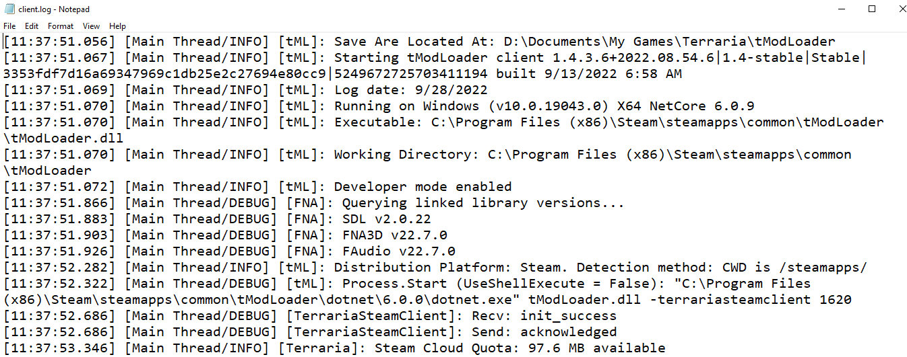

不要每 tick 打印 Info。需要大量诊断时，用 DEBUG 等级或配置开关控制。

#### 断点调试

在要观察的行左侧设置断点，触发行为后游戏暂停。黄色箭头表示“下一行将执行”，不是“这一行已经执行”。

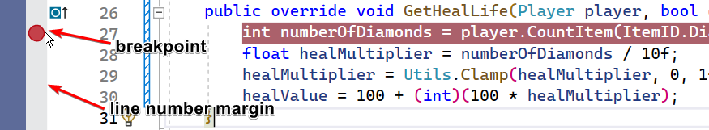

用 F10 单步越过，F11 进入方法，F5 继续；悬停变量查看当前值。

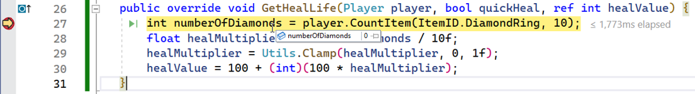

遇到 `NullReferenceException` 时，不要只盯着最后一句报错文本：

1. 看 Call Stack，找到最靠近你模组代码的栈帧。
2. 让调试器在异常抛出时中断。
3. 检查该行每个可能为空的对象。
4. 用 Find All References 找它应在哪里被赋值。

### 11.3 一个典型逻辑 Bug：整数除法

```cs
int count = 5;
float ratio = count / 10;  // 结果是 0，不是 0.5
float fixedRatio = count / 10f;
```

这类 Bug 能构建、能运行，却结果错误。断点看 `count` 和 `ratio`，比盲目改公式高效得多。

### 11.4 高频错误翻译

| 错误 | 常见原因 | 处理方向 |
| --- | --- | --- |
| `CS0103 name does not exist` | 名字拼错、作用域不对、缺字段 | 看定义位置与大小写 |
| `CS0246 type or namespace could not be found` | 缺 `using`、缺依赖、类名/命名空间错 | IDE 快速修复、检查引用 |
| `CS0117 ItemID has no definition ...` | 把模组内容当原版 ID | 使用 `ModContent` 或泛型 |
| `no suitable method found to override` | Hook 签名来自旧版本或放错基类 | 查当前 stable API，不要凭旧教程改参数 |
| `not all code paths return a value` | 返回非 void 的 Hook 有分支漏 return | 覆盖所有分支 |
| `MissingResourceException` | 资源路径/大小写/文件名不匹配 | 对照命名空间与文件结构 |
| `Object reference not set...` | 对象为 null | 断点、Call Stack、检查初始化时机 |
| `graphics functions must be called on main thread` | 后台线程调用图形 API | 把图形操作放主线程/绘制流程 |

### 11.5 建议建立最小复现模组

当复杂项目里某个 Hook 不工作时，在单独的测试模组中只保留一个类和必要资源。若最小模组正常，问题在项目内交互；若也失败，问题在 API 用法。这个习惯会让 Discord/GitHub 提问质量直接跃升。

完成标准：你能用断点而非连续十次 `Main.NewText` 找到一个逻辑错误；能根据 Call Stack 定位自己代码；提交求助时附最小复现、日志与精确触发步骤。

---

<a id="chapter-12"></a>

## 第 12 章：怎样从 ExampleMod、API 与原版代码学习

官方 Wiki 真正希望新手获得的能力，不是把教程代码背下来，而是能从“相似的原版行为”反向找到 Hook 和实现。

如果你希望系统地读完整个项目，而不只是按关键词找单个示例，请先读新增的 [ExampleMod 1.4.5 中文源码导读](docs/examplemod-1.4.5-source-guide.md)，再用[逐目录、逐类与主要方法索引](docs/examplemod-1.4.5-class-index.md)定位源码。前者按“构建 → 自动加载 → 静态定义 → 实例与运行时 → 存档/网络 → 卸载”梳理主线，并串起枪械、永久属性、生态、Boss、自定义资源五条跨模块功能链；后者覆盖本地快照的全部 559 个 C# 文件，明确区分 447 个当前文件与 112 个未参与构建的 `Old/` 历史文件。

### 12.1 查询顺序

遇到需求时按这个顺序：

1. 用一句原版语言描述行为，例如“熔火之怒只在使用木箭时把弹幕改成火箭”。
2. 在 [stable API 文档](https://docs.tmodloader.net/docs/stable/) 搜索相关类与关键词。
3. 在 [ExampleMod](https://github.com/tModLoader/tModLoader/tree/stable/ExampleMod) 搜文件名或 API 名。
4. 找一个最接近的原版物品/NPC/弹幕，查看反编译代码。
5. 复制最小必要逻辑，重命名变量、删掉无关分支，再逐步改造。
6. 用断点验证你对每个参数和状态的理解。

GitHub 的 Go to file 搜索可以快速找文件：

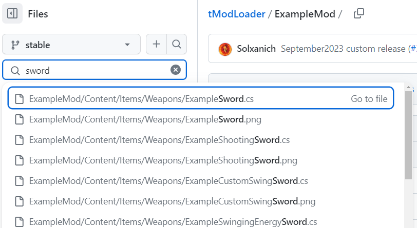

### 12.2 从 API 文档拿 Hook 的正确方式

假设要让物品在背包中持续执行逻辑：

1. 打开 `ModItem` 文档。
2. 页内搜索 `inventory`。
3. 找到 `UpdateInventory(Player player)` 的用途说明。
4. 在 IDE 中输入 `override`，让自动补全生成当前版本签名。
5. 在方法体内写最小逻辑。

不要从文档中复制含完整类型名的声明后随手删字；让 IDE 生成签名能避免版本差异和返回值错误。

### 12.3 原版代码适配，而不是整段搬运

阅读原版实现时先标注：

- 哪些是目标行为的核心。
- 哪些是原版内容 ID 或特殊进度判断。
- 哪些是网络所有权和同步。
- 哪些是视觉/音效。
- 哪些是为了兼容其他原版状态。

适配步骤：

1. 保留核心分支，先让它在自定义内容中工作。
2. 用命名 ID 替换 magic number。
3. 用 `ModContent.*Type<T>()` 替换自定义内容 Type。
4. 把局部变量改成能表达含义的名字。
5. 检查实体来源、owner、随机决策和 `netUpdate`。
6. 在单机和双客户端分别验证。

### 12.4 Wiki 与旧教程的时效性判断

看到代码先问：

- 页面是否标明 1.3、1.4.3 Legacy 或 Old？
- 是否出现 `modItem`、`projectile.aiStyle` 小写字段、`ModRecipe`、`recipe.AddRecipe()`、`DisplayName.SetDefault`、旧版 `Main.PlaySound` 等历史 API？
- 链接是否指向 `ExampleMod/Old`？
- 当前 stable API 是否存在同名 Hook？

旧页面仍可用来学习概念和算法，但代码必须回到当前 API 与 ExampleMod 校验。

### 12.5 提问方式

好的问题包含：

- 想复现的原版行为。
- 预期结果与实际结果。
- 最小相关代码，而不是整个仓库截图。
- 完整错误与 stack trace 文本。
- tModLoader 版本、单机/客户端/服务端环境。
- 已验证过的排查步骤。

“怎么做一把超酷的剑”太宽；“如何像熔火之怒一样，只把木箭转换为自定义弹幕，同时保留其他弹药”就可操作得多。

---

<a id="chapter-13"></a>

## 第 13 章：发布与维护

### 13.1 发布前清单

- `build.txt` 的 `version` 已增加，显示名、作者和依赖正确。
- `description.txt` 与 `description_workshop.txt` 已完成。
- 图标符合尺寸和内容规则。
- 新角色、新世界、只启用本模组能正常游玩。
- 双客户端/专用服务器完成冒烟测试。
- 没有调试聊天、每 tick 日志、测试配方或作弊掉落。
- 中英文键完整，至少不会显示裸键。
- 已检查客户端专用资源不会在服务端加载。
- 已测试从上一个已发布版本升级，存档没有丢失。
- 仓库没有 API Key、私密配置、个人路径或不应发布的素材。

### 13.2 版本与迁移

每次更新前阅读 [Update Migration Guide](https://github.com/tModLoader/tModLoader/wiki/Update-Migration-Guide)。tModLoader 采用稳定版和预览版节奏；面向普通玩家发布时以 stable API 为准，不要因为本机 Preview 能构建就假设所有用户都能加载。

维护时建立一张迁移表：

| 变化 | 兼容措施 |
| --- | --- |
| 重命名内容类 | `[LegacyName]`，测试旧世界/旧玩家 |
| 改本地化键 | 保留旧键或批量迁移引用 |
| 改存档键 | 读取旧键，写入新键，至少跨一个版本兼容 |
| 改存档类型 | 按旧/新类型分支读取 |
| 删除 Tile | 设计原版回退/卸载后的世界行为 |
| 新增依赖 | 更新 `build.txt` 与工坊说明 |

### 13.3 Git 的最小习惯

- 源码、HJSON、配置模板和小型素材进入版本控制。
- 构建产物、日志、IDE 临时目录按 `.gitignore` 排除。
- 每完成一个可验证的小功能提交一次。
- 发布前打 tag。
- 不直接在唯一副本上跑批量迁移；先提交，再修改，再审查 diff。

### 13.4 发布不是毕业

发布后优先收集：完整日志、版本、模组列表、复现步骤、客户端/服务端环境。修复时先添加能复现 Bug 的测试步骤，再改代码；否则很容易只修好自己的存档。

---

<a id="chapter-14"></a>

## 第 14 章：常用专题支线

前 13 章是共同基础。下面按功能选择，不必全做完才开始自己的模组。

### 14.1 弹药与远程武器

核心关系：武器通过 `Item.useAmmo` 声明接受哪类弹药；弹药 Item 通过 `Item.ammo` 声明自己属于哪一类，并用 `Item.shoot` 指向实际弹幕。

先掌握：

- 使用原版箭/子弹。
- 自定义弹药 Item + 对应 Projectile。
- 在 `PickAmmo` / `CanChooseAmmo` 等当前 Hook 中转换或筛选弹药。
- 理解是否消耗弹药与节省弹药效果。

不要只做一个“弹药物品”却忘了它发射的弹幕，也不要用物品 Type 代替弹幕 Type。

原页：[Basic Ammo](https://github.com/tModLoader/tModLoader/wiki/Basic-Ammo)。

### 14.2 Buff、Debuff、宠物与 Minion

Buff 是附着在 Player/NPC 上的计时状态；宠物和 Minion 的可见实体通常是 Projectile，Buff 负责维持它存在。

典型 Minion 由三部分组成：

1. `ModItem`：召唤并施加 Buff。
2. `ModBuff`：玩家有 Buff 时维持 Minion Projectile。
3. `ModProjectile`：跟随、索敌、移动和攻击 AI。

需要额外理解：召唤栏位、`Projectile.minion`、目标选择、接触伤害、玩家死亡时清除，以及 owner 客户端与服务端同步。

原页：[Basic Minion Guide](https://github.com/tModLoader/tModLoader/wiki/Basic-Minion-Guide)。它篇幅较长，建议完成普通弹幕和 `ModPlayer` 后再读。

### 14.3 护甲与套装

每件护甲是独立 `ModItem`，装备位置和纹理由对应装备槽决定。单件效果在装备更新 Hook 中设置；套装效果通常由头盔类判断整套并设置 `setBonus`/玩家字段。

实作顺序：

1. 先做无效果、能正确显示的三件套。
2. 再添加简单属性。
3. 用 `ModPlayer` 实现套装的主动/命中效果。
4. 最后处理发光、染料、手臂/身体贴图和复合饰品视觉。

遇到旧护甲贴图格式时阅读 [Armor Texture Migration Guide](https://github.com/tModLoader/tModLoader/wiki/Armor-Texture-Migration-Guide)。

### 14.4 Dust、发光贴图与绘制

Dust 是轻量视觉粒子，不应承载玩法状态。控制生成频率，避免所有实体每 tick 大量生成。

发光贴图（glowmask）通常在正常纹理之后以全亮颜色绘制；部分内容支持约定文件名，复杂情况用 `PostDraw`。先解决碰撞和 AI，再做拖尾、发光和 Shader。

原页：

- [Basic Dust](https://github.com/tModLoader/tModLoader/wiki/Basic-Dust)
- [Basic glowmask guide](https://github.com/tModLoader/tModLoader/wiki/Basic-glowmask-guide)
- [Assets](https://github.com/tModLoader/tModLoader/wiki/Assets)

### 14.5 声音与音乐

音效使用 `SoundStyle` / `SoundEngine`；音乐和背景使用不同的自动加载与场景效果机制。对循环声音要保存返回的活动声音标识，并在来源消失时停止。

先做一次性音效，再做位置跟随、音高/音量变化，最后才做循环和自定义音乐。

原页：[Basic Sounds](https://github.com/tModLoader/tModLoader/wiki/Basic-Sounds)。

### 14.6 掉落规则进阶

`ItemDropRule` 不是立即掉物品，而是在加载阶段构建规则树。常见规则：

- `Common`：单项概率与堆叠范围。
- `OneFromOptions`：候选中选一个。
- `ByCondition`：满足条件才尝试。
- `LeadingConditionRule`：让一组子规则共享条件。
- `OnSuccess` / `OnFailedRoll` / `OnFailedConditions`：规则链。
- `BossBag`：专家/大师模式 Boss 袋。

添加规则时只把根规则加入 `npcLoot`；子规则通过链连接。如果把子规则再次直接 Add，条件树会被绕开。

原页：[Basic NPC Drops and Loot 1.4](https://github.com/tModLoader/tModLoader/wiki/Basic-NPC-Drops-and-Loot-1.4)。没有 `1.4` 后缀的旧版掉落页主要是历史资料。

### 14.7 配方进阶

掌握基础后按需要学习：

- Recipe Group：任意木材、铁/铅等候选集合。
- 编辑或禁用现有配方。
- 控制配方排序。
- 微光分解选择。
- 自定义条件与材料消耗。
- 制作完成后的行为。
- 跨模组材料与制作站。

原页：[Intermediate Recipes](https://github.com/tModLoader/tModLoader/wiki/Intermediate-Recipes)。

### 14.8 跨模组内容

硬依赖写入 `modReferences`，可选依赖使用 `weakReferences` 并在代码中安全检测。跨模组调用优先使用对方公开的 `Mod.Call`/API，不要反射私有实现。

要处理：加载顺序、依赖缺失时的 JIT、内容查询失败、版本变化和双方联机环境一致。只有确实需要时再进入 [Expert Cross Mod Content](https://github.com/tModLoader/tModLoader/wiki/Expert-Cross-Mod-Content)。

---

<a id="chapter-15"></a>

## 第 15 章：高级主题的进入顺序

以下并不是“必修下一章”，而是危险度逐级上升的工具箱。

### 15.1 原版代码适配

这是最值得优先学的高级能力。它能解决“没有专用教程，但原版已经做过类似行为”的问题。先掌握 IDE 全局搜索、Find All References、Go to Definition 和断点，再读 [Advanced Vanilla Code Adaption](https://github.com/tModLoader/tModLoader/wiki/Advanced-Vanilla-Code-Adaption)。

### 15.2 自定义 UI 与 Shader

复杂 UI 涉及布局、输入、缩放、绘制层和客户端生命周期；Shader 还涉及 Effect、渲染状态和 SpriteBatch 切换。两者都先从 ExampleMod 的完整小示例改造，不要把多个旧教程片段拼在一起。

原页：

- [Advanced guide to custom UI](https://github.com/tModLoader/tModLoader/wiki/Advanced-guide-to-custom-UI)
- [Expert Shader Guide](https://github.com/tModLoader/tModLoader/wiki/Expert-Shader-Guide)

### 15.3 Detour / On Hook

当正常 ModLoader Hook 无法触及目标时，Detour 可以在某个方法前后包一层逻辑。风险包括：

- 原版更新导致签名/实现变化。
- 多个模组 Hook 同一方法时组合复杂。
- 忘记在 `Unload` 取消订阅，导致无法完全卸载。
- Hook 被 JIT 内联的方法可能无效。
- 捕获对象导致生命周期和内存问题。

只有确认正常 API 无法完成时再用。[Advanced Detouring Guide](https://github.com/tModLoader/tModLoader/wiki/Advanced-Detouring-Guide) 是入口。

### 15.4 IL 编辑

IL 编辑直接修改方法指令，比 Detour 更脆弱。必须理解 C# 编译后的栈式指令、模式匹配失败处理、多人兼容和版本维护成本。不要为了改一个常量就直接进入 IL；先寻找 Hook、Global 类、Detour 或可配置字段。

原页：[Expert IL Editing](https://github.com/tModLoader/tModLoader/wiki/Expert-IL-Editing)。

### 15.5 反射与补丁其他模组

反射会绕过编译期检查，补丁其他模组还会依赖对方内部实现。它们适合兼容层，不适合作为普通内容开发的默认手段。使用前先与对方作者确认是否已有公开 API。

---

<a id="appendix-a"></a>

## 附录 A：六周练习计划

这不是按“每天读几页”设计，而是按能验证的产物推进。

### 第 1 周：项目与物品闭环

- 读第 0～2 章。
- 做 2 个材料、2 把不同 useStyle 的武器、3 个配方。
- 完成中英文文本。
- 每次修改都能解释为何需要 Build + Reload。

验收：不复制整份旧教程，也能独立添加一个普通物品。

### 第 2 周：弹幕与调试

- 读第 3、11、12 章。
- 做直线、受重力、追踪三种弹幕。
- 用断点观察 `velocity`、`timeLeft` 和 `ai[]`。
- 做一次原版弹幕适配。

验收：能区分视觉、碰撞箱和 AI；能用调试器找 Bug。

### 第 3 周：NPC 与玩家效果

- 读第 4、5 章。
- 做一个原版 AI 原型敌怪和一个简单状态机敌怪。
- 添加条件生成、掉落和一个饰品效果。
- 把升级饰品复用同一 `ModPlayer` 能力。

验收：普通敌怪形成完整玩法循环，不从 Boss 起步。

### 第 4 周：存档、Tile 与世界

- 读第 6～8 章。
- 保存玩家永久计数和世界进度。
- 做 1×1 地形块、一个多格家具。
- 添加小规模矿脉生成并测试三种世界大小。

验收：不同世界/玩家的数据不串；Tile 不越界、不残留。

### 第 5 周：资源、配置与 UI

- 读第 9 章。
- 缓存额外纹理，添加声音和粒子开关。
- 做只显示一个数值的最小 UI。
- 测试分辨率、UI Scale、专用服务器加载。

验收：UI 与玩法解耦；服务器不加载客户端资源。

### 第 6 周：联机与发布候选

- 读第 10、13 章。
- 双客户端测试所有实体与世界修改。
- 修复随机决策和自定义字段同步。
- 清理日志、本地化、版本与说明。

验收：得到可发给朋友测试的 0.1.0 版本，而不是“等所有梦想功能都做完”的永恒工程。

---

<a id="appendix-b"></a>

## 附录 B：需求到 API 的速查表

| 我想做…… | 先查的类/Hook | 再看示例 |
| --- | --- | --- |
| 新物品 | `ModItem.SetDefaults` | `ExampleMod/Content/Items` |
| 配方 | `ModItem.AddRecipes` / `ModSystem.AddRecipes` | Basic / Intermediate Recipes |
| 武器发弹幕 | `Item.shoot`、`ModItem.Shoot` | ExampleMod 武器与弹幕 |
| 弹幕移动/命中 | `ModProjectile.AI`、`OnHitNPC`、`OnTileCollide` | Basic Projectile |
| 修改原版物品 | `GlobalItem` | ExampleMod/Common/GlobalItems |
| 新敌怪 | `ModNPC` | ExampleMod/Content/NPCs |
| 修改原版 NPC | `GlobalNPC` | ExampleGlobalNPC / Loot 示例 |
| 控制生成 | `ModNPC.SpawnChance`、`NPCSpawnInfo` | Basic NPC Spawning |
| 掉落 | `ModifyNPCLoot`、`ItemDropRule` | Basic NPC Drops 1.4 |
| 玩家能力 | `ModPlayer` | ExampleMod/Common/Players |
| 玩家存档 | `ModPlayer.SaveData/LoadData` | TagCompound 指南 |
| 世界进度 | `ModSystem.SaveWorldData/LoadWorldData` | DownedBossSystem |
| 世界生成 | `ModifyWorldGenTasks` | World Generation |
| 新方块/家具 | `ModTile`、`TileObjectData` | ExampleMod/Content/Tiles |
| 独立机器状态 | `ModTileEntity` | Basic Tile Entity / ExampleMod |
| 配置 | `ModConfig` | ExampleConfig |
| UI | `UIState`、`UserInterface`、`ModifyInterfaceLayers` | ExampleCoinsUI |
| 自定义资源 | `Asset<T>`、`Mod.Assets.Request` | Assets |
| 联机字段 | `NetSend/NetReceive`、`SendExtraAI`、ModPacket | Basic/Intermediate Netcode |
| 查原版行为 | 反编译、Find References | Vanilla Code Adaption |

---

<a id="appendix-c"></a>

## 附录 C：Wiki 页面取舍与阅读导航

### 优先阅读，且已融入本指南

- [Basic tModLoader Modding Guide](https://github.com/tModLoader/tModLoader/wiki/Basic-tModLoader-Modding-Guide)：项目骨架、Hook、内容引用、Type/Index、ExampleMod 学法。
- [Basic Item](https://github.com/tModLoader/tModLoader/wiki/Basic-Item)：Item 基础。
- [Basic Recipes](https://github.com/tModLoader/tModLoader/wiki/Basic-Recipes)：配方结构、条件与常见错误。
- [Basic Projectile](https://github.com/tModLoader/tModLoader/wiki/Basic-Projectile)：AI、计时、绘制、碰撞。
- [ModPlayer](https://github.com/tModLoader/tModLoader/wiki/ModPlayer)：玩家扩展的职责分离。
- [Saving and loading using TagCompound](https://github.com/tModLoader/tModLoader/wiki/Saving-and-loading-using-TagCompound)：持久化与迁移。
- [Basic Netcode](https://github.com/tModLoader/tModLoader/wiki/Basic-Netcode)：所有权、自动同步与测试。
- [Learn How To Debug](https://github.com/tModLoader/tModLoader/wiki/Learn-How-To-Debug)：隔离、文本、日志和断点。
- [Assets](https://github.com/tModLoader/tModLoader/wiki/Assets)：当前资源系统。
- [Localization](https://github.com/tModLoader/tModLoader/wiki/Localization) / [中文本地化页](https://github.com/tModLoader/tModLoader/wiki/zh%E2%80%90Localization%E2%80%90%E6%9C%AC%E5%9C%B0%E5%8C%96)：HJSON 与键。
- [World Generation](https://github.com/tModLoader/tModLoader/wiki/World-Generation)：完整但篇幅很大，按需阅读。

### 按功能阅读

- 物品与玩法：[Basic Ammo](https://github.com/tModLoader/tModLoader/wiki/Basic-Ammo)、[Basic Minion Guide](https://github.com/tModLoader/tModLoader/wiki/Basic-Minion-Guide)、[Player Item Animation](https://github.com/tModLoader/tModLoader/wiki/Player-Item-Animation)。
- NPC：[Basic NPC](https://github.com/tModLoader/tModLoader/wiki/Basic-NPC)、[Basic NPC Spawning](https://github.com/tModLoader/tModLoader/wiki/Basic-NPC-Spawning)、[Basic NPC Drops and Loot 1.4](https://github.com/tModLoader/tModLoader/wiki/Basic-NPC-Drops-and-Loot-1.4)。
- 视觉与声音：[Basic Dust](https://github.com/tModLoader/tModLoader/wiki/Basic-Dust)、[Basic Sounds](https://github.com/tModLoader/tModLoader/wiki/Basic-Sounds)、[Basic glowmask guide](https://github.com/tModLoader/tModLoader/wiki/Basic-glowmask-guide)、[Spriting](https://github.com/tModLoader/tModLoader/wiki/Spriting)。
- 世界：[Basic Tile](https://github.com/tModLoader/tModLoader/wiki/Basic-Tile)、[Wall](https://github.com/tModLoader/tModLoader/wiki/Wall)、[Basic Tile Entity](https://github.com/tModLoader/tModLoader/wiki/Basic-Tile-Entity)、[Coordinates](https://github.com/tModLoader/tModLoader/wiki/Coordinates)。
- 工程：[Intermediate Git & mod management](https://github.com/tModLoader/tModLoader/wiki/Intermediate-Git-&-mod-management)、[Workshop](https://github.com/tModLoader/tModLoader/wiki/Workshop)、[build.txt](https://github.com/tModLoader/tModLoader/wiki/build.txt)、[Logging](https://github.com/tModLoader/tModLoader/wiki/Logging)。
- 中级算法：[Intermediate Guide to AI](https://github.com/tModLoader/tModLoader/wiki/Intermediate-Guide-to-AI)、[Time and Timers](https://github.com/tModLoader/tModLoader/wiki/Time-and-Timers)、[Geometry](https://github.com/tModLoader/tModLoader/wiki/Geometry)、[Polymorphism](https://github.com/tModLoader/tModLoader/wiki/Polymorphism)。

### 只在遇到对应问题时读

- `Mod Loading Steps`：加载时机或跨模组初始化问题。
- `Named ID Sets`、`Conditions`：需要注册自定义集合/条件时。
- `Reflection`、`Detouring`、`IL Editing`、`Patching Other Mods`：正常 API 做不到时。
- `.tmod File format`、`The tModLoader development pipeline`：工具链或底层研究。
- `Update Migration Guide Previous Versions`：移植旧模组时。
- 各种 `Vanilla ... IDs/Fields/Methods` 页面：概念可参考，但优先使用当前 API 文档、IDE 和源码搜索。

### 新手阶段可以略过

- 玩家安装/故障页：你已搭好环境，遇到具体启动问题再查。
- 贡献 tModLoader 本体的指南：这是参与加载器开发，不是制作模组。
- 俄文本地化、随机空白页面等与当前开发无直接关系的内容。
- 旧版 `Basic NPC Drops and Loot`：使用带 `1.4` 的新版规则页。
- 明确位于 `ExampleMod/Old` 或标明 1.3 的代码：只学概念，不照抄。

---

<a id="appendix-d"></a>

## 附录 D：每个功能的完成定义

写完代码不等于功能完成。每个功能至少通过：

- **构建**：无错误，警告已理解。
- **加载**：新角色/新世界、仅启用本模组可加载。
- **玩法**：正常路径与边界路径都符合预期。
- **持久化**：需要保存的数据重进后仍在，不该保存的临时状态已重置。
- **联机**：Host、第二客户端、中途加入者看到一致结果。
- **服务端**：专用服务器不触碰纹理、UI、鼠标等客户端资源。
- **兼容**：至少与一个常用工具模组共同测试。
- **本地化**：无裸键、硬编码玩家文本和破坏语序的拼接。
- **性能**：没有每 tick 全世界扫描、同步洪水、资源重复加载和日志刷屏。
- **维护**：类名、职责、注释和提交能让一个月后的你读懂。

---

<a id="appendix-e"></a>

## 附录 E：图片与来源说明

本文保留的界面截图、示意图和 GIF 均来自 tModLoader 官方 Wiki 对应教程，未改变教学含义；为了避免原外链失效，本文使用的图片已保存在本目录的 `assets/` 中。

主要原图来源：

- 项目创建、骨架、构建、Type/Index、ExampleMod 搜索：Basic tModLoader Modding Guide。
- 弹幕拖尾与碰撞图：Basic Projectile。
- NPC 高度图：Basic NPC Spawning。
- Tile 类型、Origin 与 framing：Basic Tile / World Generation。
- UI 流程：Basic UI Element。
- 调试与日志：Learn How To Debug / Logging。

若某张在线图片将来失效，可从本段对应的 Wiki 页面历史版本恢复。

---

## 最后的学习原则

1. 每次只增加一个能在游戏里验证的变化。
2. 先找相似的原版行为，再找 Hook。
3. 让 IDE 生成当前版本的 override 签名。
4. 示例代码先理解，再改名、删减、测试；不要整页粘贴。
5. 单机通过不代表完成，尽早开第二客户端。
6. 玩家可见文本进入本地化，持久数据要设计迁移。
7. 能用普通 ModLoader API 时，不要急着 Detour/IL。
8. 先做一个小而完整的模组，再做宏大的 Boss Rush 宇宙。

从这里继续，最合适的下一步不是再读十页 Wiki，而是把第 2～4 章的“星屑闭环”换成你真正想做的主题，并完成一个可以交给朋友试玩的 0.1.0。
